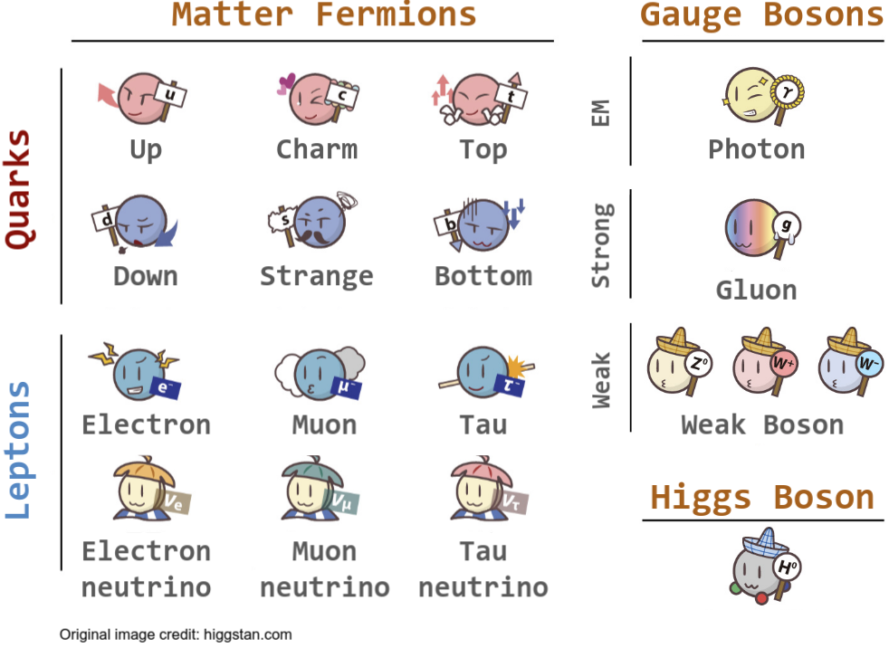

## The Weak Interaction {.unnumbered}

Weak interactions proceed through two channels: the **Charged-Current (CC)**, mediated by $W^\pm$, which converts the incoming neutrino into a charged lepton of the same flavor while changing the target's quark content; the **Neutral-Current (NC)**, mediated by the $Z$, which is flavor-blind and leaves particle identity unchanged. This distinction is experimentally crucial: CC interactions tag neutrino flavor via the outgoing charged lepton, while NC interactions are indistinguishable across letpon flavors.

```{=html}
<div style="display:flex;gap:2.5rem;justify-content:center;flex-wrap:wrap;margin:1.6rem 0 1.2rem;">

<!-- ── CC Feynman diagram ──────────────────────────────────────────── -->
<!-- viewBox 340×196: labels at outer edges, lines start/end well inside -->
<figure style="margin:0;text-align:center;">
<svg viewBox="0 0 340 196" width="310" height="179" xmlns="http://www.w3.org/2000/svg">
  <defs>
    <marker id="fcc" markerWidth="10" markerHeight="7" refX="9" refY="3.5"
            orient="auto" markerUnits="userSpaceOnUse">
      <path d="M0,0 L10,3.5 L0,7 Z" fill="#2c3e50"/>
    </marker>
  </defs>
  <!-- reaction label -->
  <text x="170" y="17" text-anchor="middle" font-size="13" fill="#555"
        font-family="Georgia,Times New Roman,serif">
    <tspan font-style="italic">&#957;</tspan><tspan font-size="9" dy="3">&#956;</tspan><tspan dy="-3"> + n &#8594; </tspan><tspan font-style="italic">&#956;</tspan><tspan font-size="9" dy="-3">&#8722;</tspan><tspan dy="3"> + p</tspan>
  </text>
  <!-- incoming ν_μ: start well right of label, stop well left of vertex -->
  <line x1="52" y1="75" x2="160" y2="75" stroke="#2c3e50" stroke-width="1.8" marker-end="url(#fcc)"/>
  <!-- outgoing μ⁻: start well right of vertex, stop well left of label -->
  <line x1="180" y1="75" x2="276" y2="75" stroke="#2c3e50" stroke-width="1.8" marker-end="url(#fcc)"/>
  <!-- incoming n -->
  <line x1="52" y1="135" x2="160" y2="135" stroke="#2c3e50" stroke-width="1.8" marker-end="url(#fcc)"/>
  <!-- outgoing p -->
  <line x1="180" y1="135" x2="276" y2="135" stroke="#2c3e50" stroke-width="1.8" marker-end="url(#fcc)"/>
  <!-- vertices -->
  <circle cx="170" cy="75"  r="3.5" fill="#2c3e50"/>
  <circle cx="170" cy="135" r="3.5" fill="#2c3e50"/>
  <!-- W⁺ wavy propagator — 6 quadratic half-waves, amplitude ±11px -->
  <path d="M170,78.5 Q181,83 170,87.5 Q159,92 170,96.5 Q181,101 170,105.5 Q159,110 170,114.5 Q181,119 170,123.5 Q159,128 170,131.5"
        stroke="#c0392b" stroke-width="2.2" fill="none"/>
  <!-- W⁺ label -->
  <text x="185" y="109" font-size="14" fill="#c0392b" font-style="italic"
        font-family="Georgia,Times New Roman,serif">W</text>
  <text x="198" y="104" font-size="11" fill="#c0392b" font-family="sans-serif">+</text>
  <!-- particle labels — placed at edges with clear gap from line endpoints -->
  <text x="4"   y="70" font-size="15" fill="#2c3e50" font-style="italic" font-family="Georgia,serif">&#957;</text>
  <text x="16"  y="77" font-size="10" fill="#2c3e50" font-family="Georgia,serif">&#956;</text>
  <text x="296" y="70" font-size="15" fill="#2c3e50" font-style="italic" font-family="Georgia,serif">&#956;</text>
  <text x="308" y="66" font-size="10" fill="#2c3e50" font-family="sans-serif">&#8722;</text>
  <text x="4"   y="130" font-size="15" fill="#2c3e50" font-style="italic" font-family="Georgia,serif">n</text>
  <text x="296" y="130" font-size="15" fill="#2c3e50" font-style="italic" font-family="Georgia,serif">p</text>
  <!-- caption -->
  <text x="170" y="188" text-anchor="middle" font-size="12.5" font-weight="bold"
        fill="#2c3e50" font-family="sans-serif">Charged Current (CC)</text>
</svg>
</figure>

<!-- ── NC Feynman diagram ──────────────────────────────────────────── -->
<figure style="margin:0;text-align:center;">
<svg viewBox="0 0 340 196" width="310" height="179" xmlns="http://www.w3.org/2000/svg">
  <defs>
    <marker id="fnc" markerWidth="10" markerHeight="7" refX="9" refY="3.5"
            orient="auto" markerUnits="userSpaceOnUse">
      <path d="M0,0 L10,3.5 L0,7 Z" fill="#2c3e50"/>
    </marker>
  </defs>
  <!-- reaction label -->
  <text x="170" y="17" text-anchor="middle" font-size="13" fill="#555"
        font-family="Georgia,Times New Roman,serif">
    <tspan font-style="italic">&#957;</tspan><tspan font-size="9" dy="3">&#956;</tspan><tspan dy="-3"> + n &#8594; </tspan><tspan font-style="italic">&#957;</tspan><tspan font-size="9" dy="3">&#956;</tspan><tspan dy="-3"> + n</tspan>
  </text>
  <!-- incoming ν_μ -->
  <line x1="52" y1="75" x2="160" y2="75" stroke="#2c3e50" stroke-width="1.8" marker-end="url(#fnc)"/>
  <!-- outgoing ν_μ -->
  <line x1="180" y1="75" x2="276" y2="75" stroke="#2c3e50" stroke-width="1.8" marker-end="url(#fnc)"/>
  <!-- incoming n -->
  <line x1="52" y1="135" x2="160" y2="135" stroke="#2c3e50" stroke-width="1.8" marker-end="url(#fnc)"/>
  <!-- outgoing n -->
  <line x1="180" y1="135" x2="276" y2="135" stroke="#2c3e50" stroke-width="1.8" marker-end="url(#fnc)"/>
  <!-- vertices -->
  <circle cx="170" cy="75"  r="3.5" fill="#2c3e50"/>
  <circle cx="170" cy="135" r="3.5" fill="#2c3e50"/>
  <!-- Z⁰ wavy propagator — 6 quadratic half-waves, amplitude ±11px -->
  <path d="M170,78.5 Q181,83 170,87.5 Q159,92 170,96.5 Q181,101 170,105.5 Q159,110 170,114.5 Q181,119 170,123.5 Q159,128 170,131.5"
        stroke="#2471a3" stroke-width="2.2" fill="none"/>
  <!-- Z⁰ label -->
  <text x="185" y="109" font-size="14" fill="#2471a3" font-style="italic"
        font-family="Georgia,Times New Roman,serif">Z</text>
  <text x="197" y="104" font-size="11" fill="#2471a3" font-family="sans-serif">0</text>
  <!-- particle labels -->
  <text x="4"   y="70" font-size="15" fill="#2c3e50" font-style="italic" font-family="Georgia,serif">&#957;</text>
  <text x="16"  y="77" font-size="10" fill="#2c3e50" font-family="Georgia,serif">&#956;</text>
  <text x="296" y="70" font-size="15" fill="#2c3e50" font-style="italic" font-family="Georgia,serif">&#957;</text>
  <text x="308" y="77" font-size="10" fill="#2c3e50" font-family="Georgia,serif">&#956;</text>
  <text x="4"   y="130" font-size="15" fill="#2c3e50" font-style="italic" font-family="Georgia,serif">n</text>
  <text x="296" y="130" font-size="15" fill="#2c3e50" font-style="italic" font-family="Georgia,serif">n</text>
  <!-- caption -->
  <text x="170" y="188" text-anchor="middle" font-size="12.5" font-weight="bold"
        fill="#2c3e50" font-family="sans-serif">Neutral Current (NC)</text>
</svg>
</figure>

</div>
```

Unlike QED, the weak interaction violates parity (spatial inversion: $\vec{x}\rightarrow -\vec{x}$): **it couples only to left-handed particles and right-handed anti-particles**, encoded in the $V-A$ structure of the weak current. This was confirmed by [C.S.Wu and her team](https://en.wikipedia.org/wiki/Wu_experiment) that the $\beta$-decay of polarized $^{60}\mathrm{Co}$ nuclei prefers the direction opposite to the external applied field.

Perhaps a more interesting symmetry to consider is the charge-conjugate-parity (CP) symmetry. We already know that CP is not conserved from [$K_L$ decay](http://hyperphysics.phy-astr.gsu.edu/hbase/Particles/kaon.html), while the question remains on its magnitude in the lepton sector. Due to thermal equilibrium the universe started as a perfect balance of matter and antimatter, however the origin of this asymmetry remains one of the deepest unsolved problems in physics---nature fundamentally prefers matter over antimatter and results in everything exists today. Therefore, understanding how CP is violated serves as a critical foundation towards the baryogenesis or leptogenesis scenarios of the universe. Neutrinos, in the lepton sector, point toward Leptogenesis as the favored scenario. There are many ingredients in the Leptogenesis, among which the **long-baseline neutrino oscillation experiments provide direct sensitivity to leptonic CP violation**, and $0\nu\beta\beta$-decay experiments probe whether neutrinos are their own antiparticles (Majorana fermions), a necessary condition for most Leptogenesis scenarios.

## Basics of Neutrinos {.unnumbered}

Neutrinos are neutral leptons that interact with matter via [weak interactions](#the-weak-interaction). So far three active flavors---$\nu_e$, $\nu_\mu$, $\nu_\tau$---are confirmed, along with a special phenomenon called "neutrino oscillation".

::: {style="text-align: center; margin-top: 1.5rem; margin-bottom: 1.5rem;"}
{style="width: max(500px, min(60%, 100%));"}
:::

### Neutrino Oscillation in vacuum {.unnumbered}

From the Standard Model and experimental observations we have three neutrino flavor eigenstates ($\nu_e$, $\nu_\mu$, $\nu_\tau$) that the weak interaction operators act on. However, the simple time-independent Hamiltonian eigenstates of a neutrino, in the absence of any potential, are the neutrino mass eigenstates. By the superposition principle, one state can be described as a linear superposition of others. This mixing of neutrino mass eigenstates into flavor states is described by the complex conjugate of Pontecorvo-Maki-Nakagawa-Sakata (PMNS) matrix:
$$
\ket{\nu_a} = \sum_{m}U^{*}_{\alpha m}\ket{\nu_m}
$$
where 

$$
U_{\mathrm{PMNS}}  =
\begin{pmatrix}
U_{e1} & U_{e2} & U_{e3} \\
U_{\mu1} & U_{\mu2} & U_{\mu3} \\
U_{\tau1} & U_{\tau2} & U_{\tau3}
\end{pmatrix}
$$
is a rotational matrix described by three mixing angles between the mass states ($\theta_{12}$, $\theta_{13}$, and $\theta_{23}$), and one Dirac CP phase $\delta_{\mathrm{CP}}$. Two additional Majorana phases $\alpha_{1}$ and $\alpha_{2}$ also exist if neutrinos are Majorana fermions.

The physical consequence of this mixing becomes apparent when we track how a flavor eigenstate evolves in time. Including the time-dependence into the mass eigenstate superposition for a neutrino flavor $a$ we have
$$
\ket{\nu_{a}(t)} = \sum_{i} U^{*}_{a i} e^{-i(E_i+m^{2}_{i}/2E_i)t} \ket{\nu_i(0)}\,\,\, (a = e, \mu, \tau)
$$
since

$$
\ket{\nu_{i}(t)} = e^{-i (E_i+m^{2}_{i}/2E_i) t} \ket{\nu_{i}(0)}
$$
Therefore the neutrino oscillation---the phenomenon that a neutrino of flavor $a$ at generation turns into flavor $b$ at detection---in vacuum is expressed as

$$
\braket{\nu_b | \nu_a(t)} = \sum_{i,j}U_{b j}e^{-i(E_i+\frac{m_i^2}{2E_i})t}U^{*}_{a i}\braket{\nu_j|\nu_i}
$$
Assuming relativistic neutrinos, we can rewrite the oscillation probability in terms of the neutrino travel distance and energy:
$$
P(a\rightarrow b) = |\braket{\nu_b | \nu_a(t)}|^2 \propto \Bigg(\frac{\Delta{m}^2_{ij} L}{E}\Bigg)
$$
in which 
$$
\Delta{m}^2_{ij} = m^2_{i} - m^2_{j}
$$
The case where $m_3$ is the heaviest eigenstate ($\Delta m_{31}^2>0$) is called **Normal Ordering (NO)**; the case where $m_3$ is the lightest  ($\Delta m_{31}^2<0$) is called **Inverted Ordering (IO)**.

It remains an open question about the exact value of $\delta_{\mathrm{CP}}$---whether it is conserved ($\sin\delta_{\mathrm{CP}}=0$) or maximally violated  ($\sin\delta_{\mathrm{CP}}=1$) or somewhere in between. This is one of the most critical tasks for the next generation long baseline neutrino oscillation experiments such as DUNE and HK, which are so far the most promising path to this measurement. 

The [vacuum oscillation calculator](neutrino-oscillation-calculator.html) provides an interactive view of how the neutrino oscillation profile varies with the these parameters for different experiment configurations.

### Matter effects	{.unnumbered}

A neutrino traveling through a medium coherently forward-scatters off background particles via weak interactions, effectively modifying the potential experienced by each flavor eigenstate. This modifies the effective oscillation parameters and can significantly alter the flavor composition at detection — an effect known as the Mikheyev-Smirnov-Wolfenstein (MSW) effect.

Of the two weak interaction channels, the Neutral-Current (NC) one is flavor-blind and can occur to any active neutrino flavor, thus it only induces a common phase factor in the free Hamiltonian that usually does not affect the neutrino oscillation experiments. On the other hand, due to the existence of bound electrons in matter, $\nu_e$ has the option of the Charged-Current (CC) channel via $W$-bosons that is not available to either $\nu_\mu$ or $\nu_\tau$.

The extra scattering probability of $\nu_e$ induces a modification only to the electron part of the Hamiltonian of neutrino flavor eigenbasis
$$
V_{e} = \pm\sqrt{2}G_{F}N_{e}
$$
where $G_{F}$ is the weak interaction coupling constant, and $N_{e}$ the density of background electrons. This effective potential is positive for $\nu_e$ and negative for $\bar\nu_e$. 

The matter effects cause degenerate results to the $\delta_{\mathrm{CP}}$ measurement, since they both modify the $\nu_e$ and $\bar\nu_e$ appearance probabilities in a similar way. On the other hand, the matter effect is strongly correlated with mass ordering — making atmospheric neutrino oscillations, where neutrinos traverse the full Earth diameter, a particularly powerful probe of NO vs. IO. 